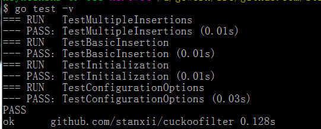

# Bloom Filter --> Counting Floom Filter --> Cuckoo Filter 进化
A Golang implement cuckoofilte  better than counting bloomfilter  -with delete feature and less space

## 捐赠我们:
## Donate us:
AliPay: 

## 先说作用与进化
* 如果有1亿的url 抓取的时候怎么知道url是否已经抓取过了呢？ 您应该想到用 floom filter 来把每个url 映射到一个位， 这样来快速定位是否抓取过了。
* 但是bloom filter 缺点是不能删除，所以有了增强版Counting bloom filter的实现可删除操作
* 在发展下来Counting bloom filter 占用空间太大是3,4倍bf的空间占有率，所以发展出来 双Hash 函数对来实现的 Cuckoo Filter (布谷鸟 BF算法，完美在应用中应用到大数据量的去重操作)

## 如果使用
```
$cd cukoofilter
$go test -v
```
显示:

## 如果使用 example目录
```
package main

import (
	"fmt"

	"github.com/stanxii/cuckoofilter"
)

func main() {
	cf := cuckoofilter.New()

	cf.Insert([]byte("http://anglia-live.com"))

	b := cf.Lookup([]byte("Hello"))
	fmt.Printf("cf.Lookup Hello === %v\n", b)

	b2 := cf.Lookup([]byte("http://anglia-live.com"))
	fmt.Printf("cf.Lookup anglia === %v\n", b2)


	cf.Count()

	bd := cf.Delete([]byte("world"))
	fmt.Printf("cf.Lookup world === %v\n", bd)

	bdel := cf.Delete([]byte("http://anglia-live.com"))
	fmt.Printf("cf.Del anglia === %v\n", bdel)

	bquery := cf.Lookup([]byte("http://anglia-live.com"))
	fmt.Printf("cf.Lookup anglia after del === %v\n", bquery)
}
```

##  一个node.js , golang, java, react 普通软件工程师 在多年的工作中一直在进步。 应用框架一直致力于为大家提供一个快速开发应用的途径，同时推广发展国内的 Go, node.js , react 发展，您的帮助是对我们最大的鼓励和支持！
我们团队这一年多来一直在坚持不懈的努力改进，并会一直坚持开源免费为大家提供最好的 Go 框架而努力，会持续不断的增加新功能，提供用户在开发中遇到的各类解决方案，如果您觉得我们的成果对你有帮助，那么我们乐意接收来自各路豪杰的捐助^_^

## 支付宝请我们喝杯咖啡：

* 01-组件版本和集群环境

您的捐赠我们将用于：
持续和深入的开发
维护社区的运行稳定
租用更好的带宽
奖励团队的杰出贡献者
社区活动或讲座
